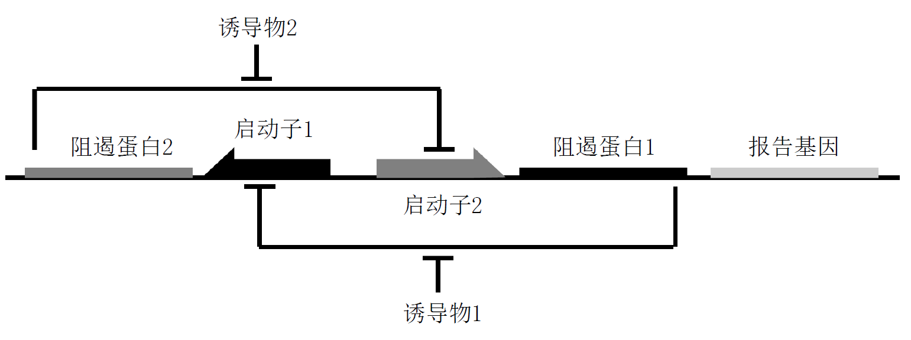

# 2022年iGEM建模组寒假任务

建模组需要完成的任务是：处理实验中所得的数据，建立数学模型，进行模拟和预测，并根据结果来给出建议。

### 1) 寒假学习建议

为了更好地完成寒假任务及正式项目中的建模任务，建议组员们在寒假期间学习以下内容：

- 学习如何使用**Markdown**来编写文档和插入公式，这是因为最后的建模结果需要呈现在网页中，而Markdown渲染的网页对公式等的支持度较好。Markdown的学习可以参考[Markdown 官方教程](https://markdown.com.cn/)和[Markdown 教程](https://www.runoob.com/markdown/md-tutorial.html)，笔者建议的编辑器是[Typora](https://www.typora.net/)和[Visual Studio Code](https://code.visualstudio.com/)。

- 复习**常微分方程（以下简称ODE）**，应至少了解常微分方程的意义和简单应用，并且了解如何用`matlab`或其他编程语言来求ODE（包括方程组）的数值解，学有余力的读者可以了解ODE的稳定性分析理论。可以参考[iGEM中的常微分方程模型](https://temp.dylandong.top/posts/iGEM中的常微分方程模型/)。
- 了解**往年iGEM建模**的工作和结果，可以参考[2021年](https://2021.igem.org/Team:XJTU-China/Model)和[2020年](https://2020.igem.org/Team:XJTU-China/Model)。

### 2) 寒假任务概述

小组的成员可以单独或组队，选择下列题目之一完成。若对多个题目有想法，也可以选择多个题目完成。

**A题 森林的清洁工**

木腐菌和许多真菌被视为森林的清洁工，它们能使枯枝、落叶分解归还于大自然，参与物质循环，同时促使森林树木天然的新陈代谢，维持生态平衡。

请完成以下任务：

- [附件A](./附件A.xlsx)给出了实验中测定的某种木腐菌的种群密度随时间的变化趋势，请处理已有数据，并且建立数学模型，预测该种木腐菌最终能达到的种群密度（单位：OD）；
- 假设环境中有一定数量的木纤维，该种木腐菌能够分解木纤维，并且种群密度越大，分解速率越快。请建立数学模型，并从0时刻开始，模拟该过程并绘制图像。

**B题 新冠疫情防控**

12月9日开始，西安市疫情日渐严重。科学精准施策，对于巩固疫情防控成果具有重要的意义。

请完成以下任务：

- [附件B](./附件B.xlsx)给出了12月9日以来西安市每日新增确诊的人数，请处理已有数据，并且建立数学模型，计算西安市疫情的“拐点”（也即新增人数开始下降的日期）和“稳定点”（也即新增人数清零的日期）；
- 将西安市简化为理想的平面，并建立平面直角坐标系。建立数学模型，模拟疫情从某点开始扩散的趋势，并绘制出图像。

**C题 双稳态开关**

双稳态开关可以实现基因线路在两种不同稳定状态间的切换。

如图所示，两种不同的启动子1和启动子2，分别控制着阻遏子2和阻遏子1的基因表达。阻遏子2和阻遏子1的基因表达产物又分别抑制着启动子2和启动子1的启动。其中，阻遏子1的下游报告基因的表达产物可以作为输出信号，表征系统目前所处的状态。系统可以通过如下的方式，在不同的稳定状态间切换：

- 启动子1表达，产生阻遏子2，抑制启动子2，阻遏子1不表达，此时系统稳定于启动子1开启而启动子2关闭；
- 启动子2启动，产生阻遏子1，抑制启动子1，阻遏子2不表达，此时系统稳定于启动子2开启而启动子1抑制，且系统有产物输出。

请对该过程进行建模，并且模拟最后阻遏蛋白1和阻遏蛋白2的产量。

### 3) 验收方式

考虑到学校的返校和考试等安排，寒假任务的截止时间将另行通知。提交要求和评分方式如下：

- 报告需要包含模型介绍、结果呈现等方面，要求格式为`.md`，命名为`A/B/C + 姓名`；

- 若有程序文件或是输出的结果，可以一并附上，并打包成压缩文件，压缩文件的命名同上；

- 若题目需要计算出答案，将根据答案与真实答案的相对误差打分；

- 若题目需要进行模拟，将考虑解决问题过程中所建立的模型和模拟的结果，综合进行打分；

- 本次寒假任务为初次选拔，如无特殊情况，未参加者将视为放弃比赛。

最终将会综合个人能力、参与度、参与意愿等因素，选择出合适的人选，进入最后的成员名单。